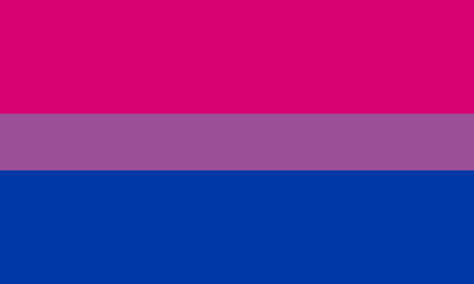

# Amazingly formatted github page!!!! :3

I use this site for doing whatever (usually for making games in unity)  
Check out my [itch.io](https://deltav2.itch.io), [Youtube](https://www.youtube.com/@DeltaV_), and Bluesky (i dont have the link rn lol)  
[Also here's a "mirror" of one of my games](https://delta-airlines-ig.github.io/Dash-With-The-Fireball-Etc/ )  

 
